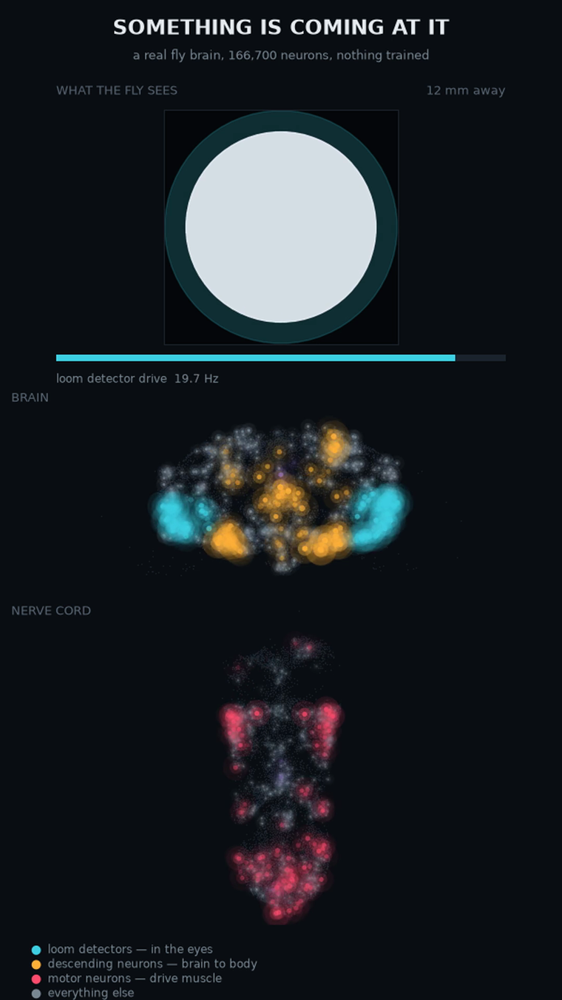
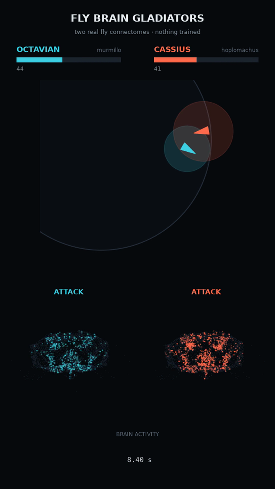

# Fly Brain Gladiators

Two gladiators fight in an arena. Both are controlled by the real fruit fly connectome — 166,700 neurons from the complete *Drosophila* central nervous system released by Google Research and HHMI Janelia in September 2026.

**Nothing is trained.** No reinforcement learning, no reward function, no learned policy sitting on top of the network. The only things chosen were which neurons read the arena and which neurons swing the weapon. Everything else is the fly's own wiring.


*Stimulating the loom detectors at 20 Hz. Every dot is a neuron at its actual soma position in the fly. Cyan are the LC4/LPLC2 loom detectors, sitting in both optic lobes because that is where they are. Amber are descending neurons, pink are motor neurons in the nerve cord. Over 100 ms you can watch the signal cross from brain to cord.*



*The link is causal, not decorative: the object's angular expansion rate sets the loom-detector firing rate, and the simulation advances in 4 ms slices with membrane state carried across them.*



*A match. The arena above, both fighters' brains below. Every tick the arena tells each brain what it sees, advances it 20 ms with membrane state intact, and reads its descending and motor neurons. Nothing between the sensory encoding and the motor readout is designed.*

---

> **Status: the simulation runs.** The connectome loads, the network spikes, and matches play out end to end in a window or to mp4. The roster and tournament runner are not built yet. See [`ROADMAP.md`](ROADMAP.md).

## Documentation

| | |
|---|---|
| [`PRIMER.md`](PRIMER.md) | Background from zero — what a connectome is, how it was mapped, the fly biology, and the computer science. No prior knowledge assumed in either field |
| [`METHODS.md`](METHODS.md) | The tools (Neuroglancer, neuPrint, Codex) and a detailed walkthrough of the Shiu et al. 2024 model this builds on |
| [`REFERENCE.md`](REFERENCE.md) | Circuits used, simulation parameters, dataset access, gladiator classes |
| [`ROADMAP.md`](ROADMAP.md) | Design constraints, build phases, and open questions |

## The dodge is a real circuit

**LC4** and **LPLC2** are looming detectors — they fire when an object approaches on a collision course. They drive the **giant fiber (DNp01)**, the fly's escape-jump command neuron.

A lunging opponent *is* a looming stimulus. So the dodge mechanic wasn't designed, it was discovered:

```
opponent lunges → LC4/LPLC2 fire → giant fiber spikes → fighter jumps back
```

That's a documented circuit doing exactly what a fighting game needs — and it only works because an attack really does drive the body forward. Standing still and reaching produces no expansion, nothing for the loom detectors to see, and no dodge.

The same geometry is why a fighter has to discount its own movement. Expansion is measured from where a fighter is now against where its opponent *was*, which is the corollary discharge a fly uses to tell its own optic flow from the world's. Without it, advancing on an opponent looks exactly like being charged by one, and a fighter triggers its own escape reflex every time it steps forward.

## Steering is a different circuit entirely

Looming detectors have **zero** direct connections onto DNa02, the steering neuron. A fighter that only watches for collisions cannot turn towards anything.

What it steers by is **LC10a**, the channel a male fly uses to track another fly. Driving it on one side produces a clean DNa02 asymmetry — ±0.9 against a baseline of exactly zero — and DNa02 turns the fly towards that side.

```
opponent off to one side → LC10a in that eye → DNa02 on that side → turn towards it
```

---

## The fighters differ biologically, not by training

There is one connectome, so both fighters have identical wiring. They differ by knobs that are real properties of the nervous system:

| Fighter | Profile | Class | Style |
|---|---|---|---|
| **OCTAVIAN** | Octopamine gain 3× — octopamine is the fly's real aggression neuromodulator | Murmillo | Relentless, defends badly |
| **CASSIUS** | LC4/LPLC2 loom gain 4×, low giant-fiber threshold | Hoplomachus | Dodges everything, rarely commits |
| **NOX** | Optic lobes lesioned | Thraex | Blind, mechanosensory only, unpredictable |
| **BASTION** | DNp09 stopping-neuron dominant | Murmillo | Turtles |
| **GEMINI-A / B** | Identical profile, different random seed | Thraex | Twins |

Full profiles are in [`fighters/`](fighters/) — they're data, not weights.

## Weapon classes are real Roman gladiator loadouts

**Murmillo** (short sword + large shield) · **Hoplomachus** (spear + small shield) · **Thraex** (curved blade + small shield) · **Retiarius** (net + trident)

Murmillo versus hoplomachus was a standard historical pairing — sword-and-heavy-shield against spear-and-reach.

---

## Running it

Every match is deterministic given its seed, so any result here can be re-run and verified.

```bash
uv venv && uv pip install -e .
python -m fbg.data                                  # fetch MaleCNS, ~1.1 GB

# watch a fight in a window — pause, scrub, step, change camera
PYTHONPATH=. python scripts/play_live.py OCTAVIAN CASSIUS 1

# or render it to mp4
PYTHONPATH=. python scripts/play_fight.py OCTAVIAN CASSIUS 1

# just the numbers
PYTHONPATH=. python scripts/fight.py OCTAVIAN CASSIUS 1
```

**Viewer controls:** `space` pause · `← →` scrub and step · `↑ ↓` speed · `c` camera · `b` brain panels · `h` HUD · `r` restart · `s` screenshot

---

## Watch

- **Matches and predictions:** <!-- TODO: site URL -->
- **YouTube:** <!-- TODO -->

Predictions use **virtual points only — no cash value, no purchases, no payouts.**

---

## What this is and isn't

**It is:** a project that wires the real fly connectome to a fighting game without training anything on top, using the documented aggression and escape circuits.

**It is not:** a scientific claim. No null-model controls are run, so this does not establish that the connectome's specific wiring matters more than its degree statistics would. That is a genuine open question with published work on both sides, and it is not what this project answers.

Nothing here is "uploaded," conscious, or learning.

Contributions and corrections are welcome — particularly on circuit selection, neurotransmitter sign handling, and anywhere the simulation diverges from the reference model.

---

## Attribution

Connectome data: **MaleCNS v1.0**, HHMI Janelia FlyEM in collaboration with Google Research, the University of Cambridge and MRC LMB (2026). Licensed **CC-BY**.

Simulation parameters follow Shiu et al., *Nature* (2024).

## Licence

MIT (code). Connectome data is CC-BY and attributed above.
